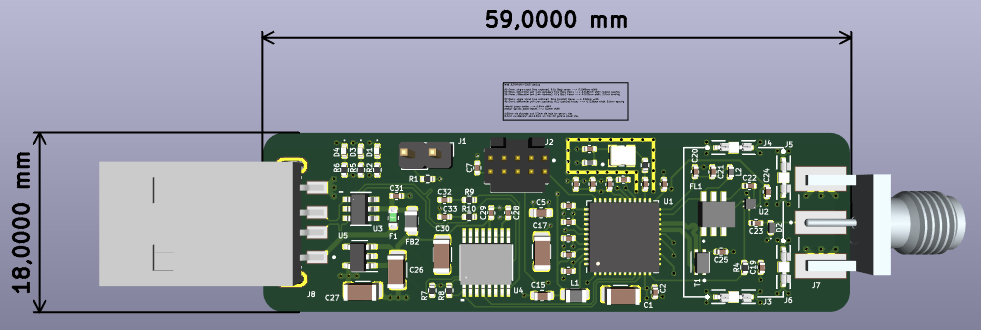

# SMT32WLE5_RF_dongle

The **SMT32WLE5_RF_dongle** is a compact RF dongle designed for wireless communication through USB. Built around the STM32WLE5 microcontroller, it enables easy radio communication over USB.

