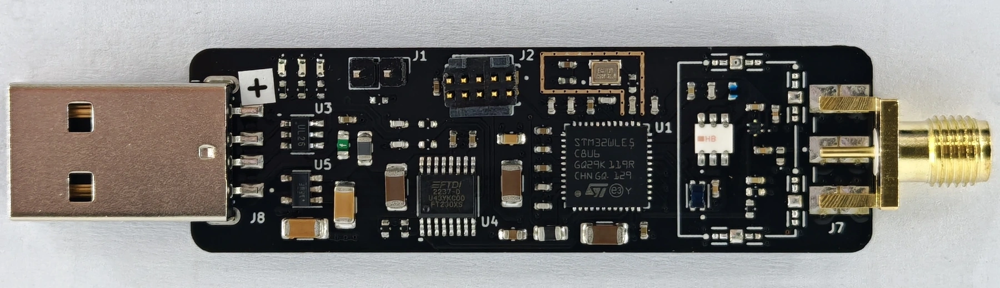
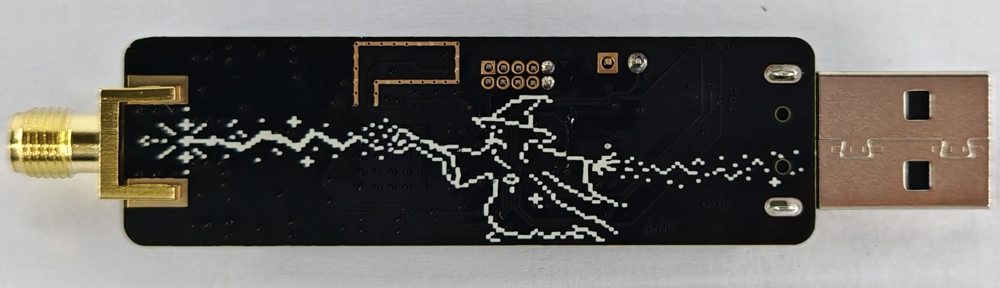

# STM32WLE5 RF dongle

The **STM32WLE5 RF dongle** is a compact USB-controlled laboratory Sub-GHz radio built around the STM32WLE5C8U6 MCU. This repository brings together the hardware and software designs developed using V-model methodology.

| STM32WLE5 RF dongle front | STM32WLE5 RF dongle back |
|:---:|:---:|
|  |  |

The project is developed using the [Embedded Workbench](https://github.com/FBS93/embedded_workbench) template.

## Highlights

- **150–960 MHz RF range** through one bidirectional, half-duplex RF port.
- **LoRa and FSK/GFSK transmit and receive**, plus **MSK/GMSK and BPSK transmit** configuration.
- Packet TX/RX, LoRa channel-activity detection, continuous wave and preamble TX, radio calibration, and diagnostics.
- **USB Virtual COM Port control** with COBS-framed commands and CRC-16/XMODEM integrity.
- Event-driven target firmware architecture.

## Usage

The STM32WLE5 RF dongle has two usage methods:

- **Direct USB:** Commands sent directly over the USB connection.
- **CLI:** Command-line interface tool that abstracts the direct USB commands.

## Documentation

- [Embedded Workbench overview](doc/ew.md) - template, environment, and development entry point.
- [Project specifications](spec/).
- [System requirements](sys/req/) and [system architecture](sys/arch/).
- [Hardware design](hw/).
- [Software requirements](sw/req/), [software architecture](sw/arch/), and [software detailed design and implementation](sw/src/).
