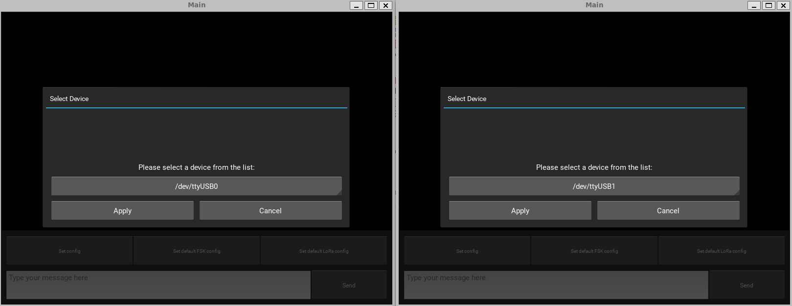

# SMT32WLE5_RF_dongle

The **SMT32WLE5_RF_dongle** is a compact RF dongle designed for wireless communication via USB. Built around the STM32WLE5C8U6 microcontroller, it enables straightforward radio communication in the sub-GHz range of 150–960 MHz. Supports LoRa and (G)FSK modulations for both transmission and reception, as well as BPSK/(G)MSK for transmission only.

This repository provides both the hardware design and an example software project that includes firmware for the STM32WLE5C8U6 microcontroller, along with a Kivy-based desktop app to control the RF dongle. The project is packaged in a devcontainer for Visual Studio Code, but adaptable as needed.

Below you will find a brief guide on how to set up the development environment used.

# Setting up the development environment

## Development environment

The following setup was used during the development of this project. While the project should work with similar setups, using these versions will help minimize compatibility issues.

- **Windows Subsystem for Linux (WSL)**: version 2.3.24.0
- **Visual Studio Code**: version 1.95.2
- **Remote Development (VSode extension)**:  version 0.26.0
- **ST-LINK/V2**

Useful links:

- [Developing inside a Container](https://code.visualstudio.com/docs/devcontainers/containers)
- [Connecting USB devices to WSL](https://learn.microsoft.com/en-us/windows/wsl/connect-usb)

## Quick start

Once inside the devcontainer you will find the following folders:

- `hardware/`: contains all the hardware design files of this project. You can find the full hardware design in a KiCad project format, including the schematic, PCB layout, and associated files. Additionally, the folder includes the KiCad libraries that were used for this design.

- `software/stm32wle5_rf_dongle_example/`: contains an example firmware for the STM32WLE5C8U6 microcontroller, along with a Kivy-based desktop app to control the RF dongle.

After opening the VSCode workspace defined in the `.vscode/.code-workspace` file, you should see the following icons in the VSCode status bar: 

- **[Preset]**: Presets for the STM32WLE5C8U6 firmware

- **🛠 C**: Predefined tasks to work with the STM32WLE5C8U6 firmware
  - 🔨 Build &rarr; Compile the firmware
  - 🐞 Debug &rarr; Debug the firmware on target
  - ⚡ Flash &rarr; Flash the firmware to the target
  - 🧹 Clean &rarr; Remove firmware build

- **🐍 Python**:  Predefined tasks to work with the Kivy desktop app
  - ▶ Run &rarr; Execute the Kivy app
  - 🐞 Debug &rarr; Debug the Kivy app
  - 🧹 Clean &rarr; Clean all \_\_pycache__

- **🧰 Toolbox**: Predefined tasks to open the tools used for the Hardware and Software design
  - ⚙️ STM32CubeMX
  - ⚡ KiCad

## Running the example software

The following screenshots show the communication between two SMT32WLE5_RF_dongle using the example software provided in this repository.

