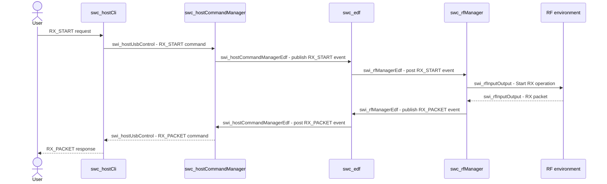

# sw_host_command_manager_sequence_diagram

## Description

Dynamic view of a representative RF receive (RX) operation.

## Diagram

```mermaid
sequenceDiagram
    actor User
    participant SW_ARCH_COMPONENT_1 as swc_hostCli
    participant SW_ARCH_COMPONENT_2 as swc_hostCommandManager
    participant SW_ARCH_COMPONENT_5 as swc_edf
    participant SW_ARCH_COMPONENT_3 as swc_rfManager
    participant RFENV as RF environment

    User->>SW_ARCH_COMPONENT_1: RX_START request
    %% SW_ARCH_INTERFACE_1
    SW_ARCH_COMPONENT_1->>SW_ARCH_COMPONENT_2: swi_hostUsbControl - RX_START command
    %% SW_ARCH_INTERFACE_4
    SW_ARCH_COMPONENT_2->>SW_ARCH_COMPONENT_5: swi_hostCommandManagerEdf - publish RX_START event
    %% SW_ARCH_INTERFACE_5
    SW_ARCH_COMPONENT_5->>SW_ARCH_COMPONENT_3: swi_rfManagerEdf - post RX_START event
    %% SW_ARCH_INTERFACE_2
    SW_ARCH_COMPONENT_3->>RFENV: swi_rfInputOutput - Start RX operation
    %% SW_ARCH_INTERFACE_2
    RFENV-->>SW_ARCH_COMPONENT_3: swi_rfInputOutput - RX packet
    %% SW_ARCH_INTERFACE_5
    SW_ARCH_COMPONENT_3->>SW_ARCH_COMPONENT_5: swi_rfManagerEdf - publish RX_PACKET event
    %% SW_ARCH_INTERFACE_4
    SW_ARCH_COMPONENT_5->>SW_ARCH_COMPONENT_2: swi_hostCommandManagerEdf - post RX_PACKET event
    %% SW_ARCH_INTERFACE_1
    SW_ARCH_COMPONENT_2-->>SW_ARCH_COMPONENT_1: swi_hostUsbControl - RX_PACKET command
    SW_ARCH_COMPONENT_1-->>User: RX_PACKET response
```

Status: approved
