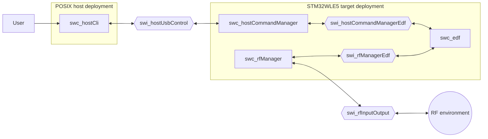

# sw_static_component_diagram

## Description

Static software-architecture view of the host and target deployments.

## Diagram

```mermaid
flowchart LR
    USER[User]
    RFENV((RF environment))

    subgraph HOST[POSIX host deployment]
        SW_ARCH_COMPONENT_1[swc_hostCli]
    end

    subgraph TARGET[STM32WLE5 target deployment]
        SW_ARCH_COMPONENT_2[swc_hostCommandManager]
        SW_ARCH_COMPONENT_3[swc_rfManager]
        SW_ARCH_COMPONENT_5[swc_edf]

        SW_ARCH_INTERFACE_4{{swi_hostCommandManagerEdf}}
        SW_ARCH_INTERFACE_5{{swi_rfManagerEdf}}

        SW_ARCH_COMPONENT_2 <--> SW_ARCH_INTERFACE_4 <--> SW_ARCH_COMPONENT_5
        SW_ARCH_COMPONENT_3 <--> SW_ARCH_INTERFACE_5 <--> SW_ARCH_COMPONENT_5
    end

    SW_ARCH_INTERFACE_1{{swi_hostUsbControl}}
    SW_ARCH_INTERFACE_2{{swi_rfInputOutput}}

    USER --> SW_ARCH_COMPONENT_1
    SW_ARCH_COMPONENT_1 <--> SW_ARCH_INTERFACE_1 <--> SW_ARCH_COMPONENT_2
    SW_ARCH_COMPONENT_3 <--> SW_ARCH_INTERFACE_2 <--> RFENV
```

Status: approved
