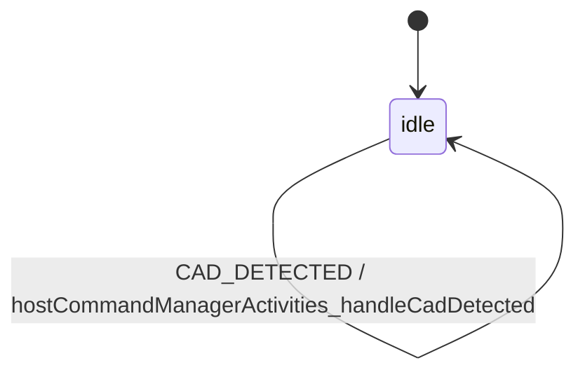

# host_command_manager HSM

```mermaid
stateDiagram-v2
    [*] --> idle

    idle --> idle : HOST_DATA_AVAILABLE / hostCommandManagerActivities_handleHostDataAvailable
    idle --> idle : GET_CONFIG_RESPONSE / hostCommandManagerActivities_handleGetConfigResponse
    idle --> idle : GET_DIAGNOSTICS_RESPONSE / hostCommandManagerActivities_handleGetDiagnosticsResponse
    idle --> idle : RX_PACKET / hostCommandManagerActivities_handleRxPacket
    idle --> idle : CAD_DETECTED / hostCommandManagerActivities_handleCadDetected
```
