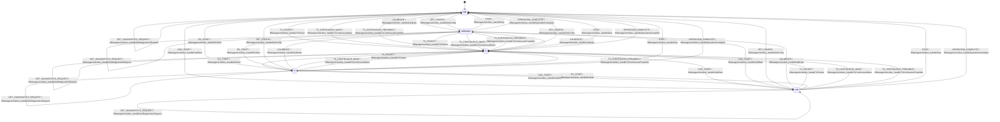

# rf_manager HSM

```mermaid
stateDiagram-v2
    [*] --> idle

    idle --> idle : GET_CONFIG_REQUEST / rfManagerActivities_handleGetConfigRequest
    idle --> idle : SET_CONFIG / rfManagerActivities_handleSetConfig
    idle --> calibration : CALIBRATE / rfManagerActivities_handleCalibrate
    idle --> tx : TX_PACKET / rfManagerActivities_handleTxPacket
    idle --> rx : RX_START / rfManagerActivities_handleRxStart
    idle --> cad : CAD_START / rfManagerActivities_handleCadStart
    idle --> tx : TX_CONTINUOUS_WAVE / rfManagerActivities_handleTxContinuousWave
    idle --> tx : TX_CONTINUOUS_PREAMBLE / rfManagerActivities_handleTxContinuousPreamble
    idle --> idle : STOP / rfManagerActivities_handleStop
    idle --> idle : GET_DIAGNOSTICS_REQUEST / rfManagerActivities_handleGetDiagnosticsRequest

    tx --> tx : GET_CONFIG_REQUEST / rfManagerActivities_handleGetConfigRequest
    tx --> idle : SET_CONFIG / rfManagerActivities_handleSetConfig
    tx --> calibration : CALIBRATE / rfManagerActivities_handleCalibrate
    tx --> tx : TX_PACKET / rfManagerActivities_handleTxPacket
    tx --> rx : RX_START / rfManagerActivities_handleRxStart
    tx --> cad : CAD_START / rfManagerActivities_handleCadStart
    tx --> tx : TX_CONTINUOUS_WAVE / rfManagerActivities_handleTxContinuousWave
    tx --> tx : TX_CONTINUOUS_PREAMBLE / rfManagerActivities_handleTxContinuousPreamble
    tx --> idle : STOP / rfManagerActivities_handleStop
    tx --> tx : GET_DIAGNOSTICS_REQUEST / rfManagerActivities_handleGetDiagnosticsRequest
    tx --> idle : OPERATION_COMPLETE / rfManagerActivities_handleOperationComplete

    rx --> rx : GET_CONFIG_REQUEST / rfManagerActivities_handleGetConfigRequest
    rx --> idle : SET_CONFIG / rfManagerActivities_handleSetConfig
    rx --> calibration : CALIBRATE / rfManagerActivities_handleCalibrate
    rx --> tx : TX_PACKET / rfManagerActivities_handleTxPacket
    rx --> rx : RX_START / rfManagerActivities_handleRxStart
    rx --> cad : CAD_START / rfManagerActivities_handleCadStart
    rx --> tx : TX_CONTINUOUS_WAVE / rfManagerActivities_handleTxContinuousWave
    rx --> tx : TX_CONTINUOUS_PREAMBLE / rfManagerActivities_handleTxContinuousPreamble
    rx --> idle : STOP / rfManagerActivities_handleStop
    rx --> rx : GET_DIAGNOSTICS_REQUEST / rfManagerActivities_handleGetDiagnosticsRequest
    rx --> idle : OPERATION_COMPLETE / rfManagerActivities_handleOperationComplete

    cad --> cad : GET_CONFIG_REQUEST / rfManagerActivities_handleGetConfigRequest
    cad --> idle : SET_CONFIG / rfManagerActivities_handleSetConfig
    cad --> calibration : CALIBRATE / rfManagerActivities_handleCalibrate
    cad --> tx : TX_PACKET / rfManagerActivities_handleTxPacket
    cad --> rx : RX_START / rfManagerActivities_handleRxStart
    cad --> cad : CAD_START / rfManagerActivities_handleCadStart
    cad --> tx : TX_CONTINUOUS_WAVE / rfManagerActivities_handleTxContinuousWave
    cad --> tx : TX_CONTINUOUS_PREAMBLE / rfManagerActivities_handleTxContinuousPreamble
    cad --> idle : STOP / rfManagerActivities_handleStop
    cad --> cad : GET_DIAGNOSTICS_REQUEST / rfManagerActivities_handleGetDiagnosticsRequest
    cad --> idle : OPERATION_COMPLETE / rfManagerActivities_handleOperationComplete

    calibration --> calibration : GET_CONFIG_REQUEST / rfManagerActivities_handleGetConfigRequest
    calibration --> idle : SET_CONFIG / rfManagerActivities_handleSetConfig
    calibration --> calibration : CALIBRATE / rfManagerActivities_handleCalibrate
    calibration --> tx : TX_PACKET / rfManagerActivities_handleTxPacket
    calibration --> rx : RX_START / rfManagerActivities_handleRxStart
    calibration --> cad : CAD_START / rfManagerActivities_handleCadStart
    calibration --> tx : TX_CONTINUOUS_WAVE / rfManagerActivities_handleTxContinuousWave
    calibration --> tx : TX_CONTINUOUS_PREAMBLE / rfManagerActivities_handleTxContinuousPreamble
    calibration --> idle : STOP / rfManagerActivities_handleStop
    calibration --> calibration : GET_DIAGNOSTICS_REQUEST / rfManagerActivities_handleGetDiagnosticsRequest
    calibration --> idle : OPERATION_COMPLETE / rfManagerActivities_handleOperationComplete
```
