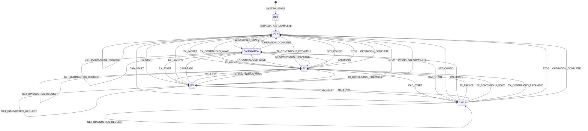

# sys_modes_state_diagram

## Description

This diagram is a compact abstraction of the RF-operation lifecycle with six architectural states: `INIT`, `IDLE`, `TX`, `RX`, `CAD`, and `CALIBRATION`. `INIT` is the internal startup phase; host commands are modeled from the host-visible states, and active operations return to `IDLE` when complete. `TX` groups the three transmit operation variants.

## State diagram

## States

| State | Description |
|---|---|
| `INIT` | Internal startup phase before the controller is ready for normal operation. MCU radio startup/cold-start calibration is included here as an implementation detail; it is not a host-visible command state. |
| `IDLE` | No host-visible RF operation is active. |
| `TX` | One transmit operation is active; packet and continuous transmit variants are abstracted by this mode. |
| `RX` | The configured receive operation is active. |
| `CAD` | The configured channel-activity-detection operation is active. |
| `CALIBRATION` | The explicit host radio-calibration operation is active. |

## Events

| Event | Description |
|---|---|
| `GET_CONFIG_REQUEST` | Reception on [SYS_ARCH_INTERFACE_1](sys_interfaces.md#sys_arch_interface_1) requests the current RF configuration; self-transition from each host-visible state. [SYS_REQ_INTERFACE_1](../req/sys_interfaces.md#get-config-request) |
| `SET_CONFIG` | Reception on [SYS_ARCH_INTERFACE_1](sys_interfaces.md#sys_arch_interface_1) applies the RF configuration; transition to `IDLE` from each active state and self-transition from `IDLE`. [SYS_REQ_INTERFACE_1](../req/sys_interfaces.md#set-config-request) |
| `CALIBRATE` | Reception on [SYS_ARCH_INTERFACE_1](sys_interfaces.md#sys_arch_interface_1) starts calibration in `CALIBRATION`, preempting any active state. [SYS_REQ_INTERFACE_1](../req/sys_interfaces.md#calibrate-request) |
| `TX_PACKET` | Reception on [SYS_ARCH_INTERFACE_1](sys_interfaces.md#sys_arch_interface_1) starts packet transmission in `TX`, preempting any active state. [SYS_REQ_INTERFACE_1](../req/sys_interfaces.md#tx-packet-request) |
| `RX_START` | Reception on [SYS_ARCH_INTERFACE_1](sys_interfaces.md#sys_arch_interface_1) starts the configured receive operation in `RX`, preempting any active state. [SYS_REQ_INTERFACE_1](../req/sys_interfaces.md#rx-start-request) |
| `CAD_START` | Reception on [SYS_ARCH_INTERFACE_1](sys_interfaces.md#sys_arch_interface_1) starts the configured CAD operation in `CAD`, preempting any active state. [SYS_REQ_INTERFACE_1](../req/sys_interfaces.md#cad-start-request) |
| `TX_CONTINUOUS_WAVE` | Reception on [SYS_ARCH_INTERFACE_1](sys_interfaces.md#sys_arch_interface_1) starts continuous-wave transmission in `TX`, preempting any active state. [SYS_REQ_INTERFACE_1](../req/sys_interfaces.md#tx-continuous-wave-request) |
| `TX_CONTINUOUS_PREAMBLE` | Reception on [SYS_ARCH_INTERFACE_1](sys_interfaces.md#sys_arch_interface_1) starts infinite-preamble transmission in `TX`, preempting any active state. [SYS_REQ_INTERFACE_1](../req/sys_interfaces.md#tx-continuous-preamble-request) |
| `STOP` | Reception on [SYS_ARCH_INTERFACE_1](sys_interfaces.md#sys_arch_interface_1) terminates the active RF operation; transition to `IDLE` from each active state and self-transition from `IDLE`. [SYS_REQ_INTERFACE_1](../req/sys_interfaces.md#stop-request) |
| `GET_DIAGNOSTICS_REQUEST` | Reception on [SYS_ARCH_INTERFACE_1](sys_interfaces.md#sys_arch_interface_1) retrieves diagnostics without changing the mode; self-transition from each host-visible state. [SYS_REQ_INTERFACE_1](../req/sys_interfaces.md#get-diagnostics-request) |
| `SYSTEM_START` | Internal system-start event entering the controller startup phase. [SYS_ARCH_DESIGN_1](sys_designs.md#sys_arch_design_1) |
| `INITIALIZATION_COMPLETE` | Internal startup-completion event indicating that the controller is ready for normal operation. [SYS_ARCH_DESIGN_1](sys_designs.md#sys_arch_design_1) |
| `OPERATION_COMPLETE` | Internal operation-completion event returning `TX`, `RX`, `CAD`, or `CALIBRATION` to `IDLE`; RX and CAD lifecycle behavior follows [RX operation](../req/sys_interfaces.md#rx-operation) and [CAD operation](../req/sys_interfaces.md#cad-operation). [SYS_ARCH_DESIGN_1](sys_designs.md#sys_arch_design_1) |
