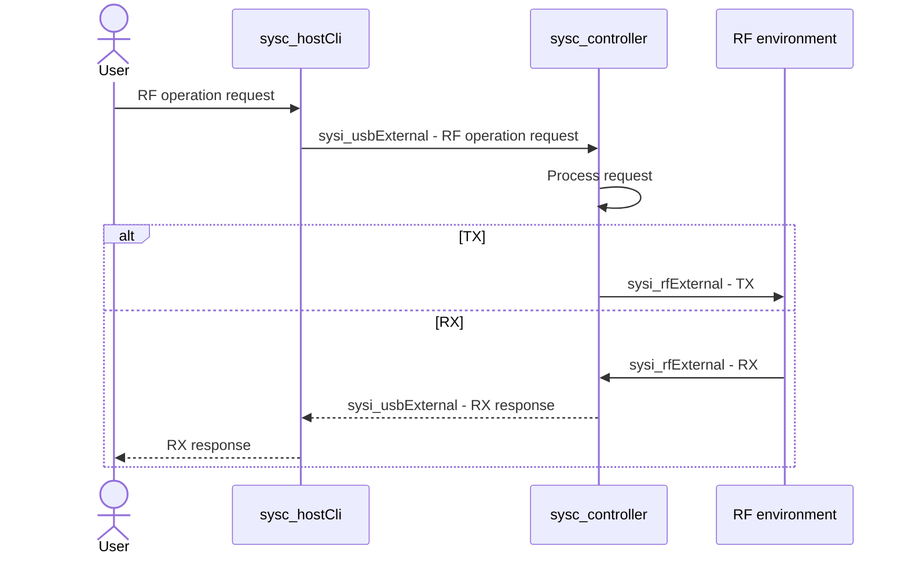

# sys_rf_operation_sequence_diagram

## Description

Dynamic view of a representative RF-operation exchange. The sequence traces the User request through `sysc_hostCli` and `sysi_usbExternal`, `sysc_controller` processing, and the mutually exclusive TX/RX interaction through `sysi_rfExternal`. TX has no operation response; RX returns its result or response to the User through `sysi_usbExternal` and the User CLI.

## Diagram

