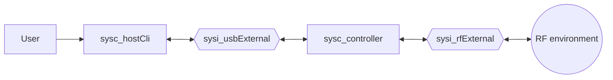

# sys_static_component_diagram

## Description

Static system-architecture view.

## Diagram

```mermaid
flowchart LR
    USER[User]
    RFENV((RF environment))

    SYS_ARCH_INTERFACE_1{{sysi_usbExternal}}
    SYS_ARCH_INTERFACE_2{{sysi_rfExternal}}

    SYS_ARCH_COMPONENT_2[sysc_hostCli]
    SYS_ARCH_COMPONENT_1[sysc_controller]

    USER --> SYS_ARCH_COMPONENT_2
    SYS_ARCH_COMPONENT_2 <--> SYS_ARCH_INTERFACE_1
    SYS_ARCH_INTERFACE_1 <--> SYS_ARCH_COMPONENT_1
    SYS_ARCH_COMPONENT_1 <--> SYS_ARCH_INTERFACE_2
    SYS_ARCH_INTERFACE_2 <--> RFENV
```
