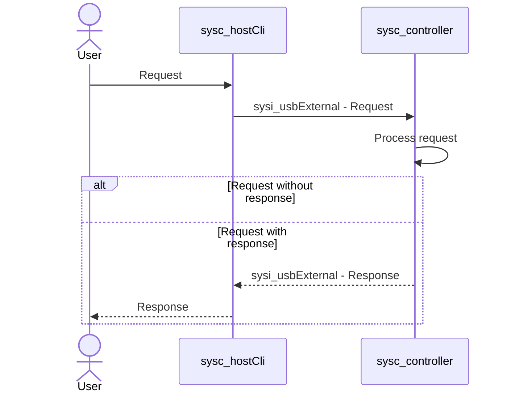

# sys_usb_control_sequence_diagram

## Description

Dynamic view of a representative USB control exchange. The User sends a request through `sysc_hostCli` and `sysi_usbExternal`; `sysc_controller` processes it, then either sends no response or returns a response through the same interface and the User CLI.

## Diagram

